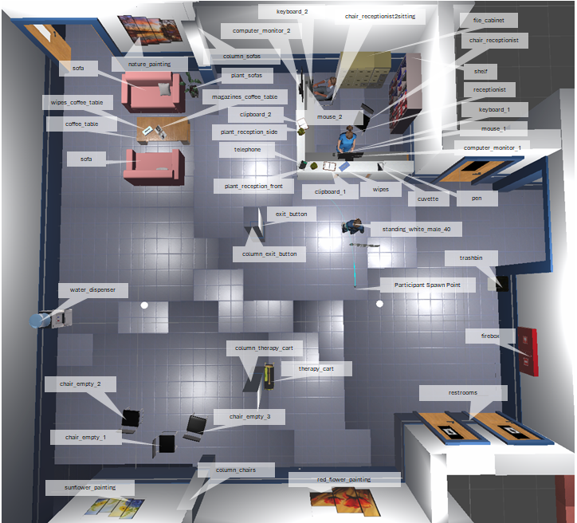

# Object Names
The EyeGazeLog_WITHOUT_NOTIFICATION.csv and EyeGazeLog_NOTIFICATION.csv found in the [VRData](https://github.com/Terascale-All-sensing-Research-Studio/vr-queue-waiting-sound-dataset/blob/main/VRData/) folder for each participant contains a column titled ObjectName that stores the name of the object being observed. [The Top Down View](#Top-Down-View) provides a bird's eye view of the scene with the ObjectNames for each object. We label the location where the participant spawns as **Participant Spawn Point**. 

### Top Down View

The following ObjectNames are visible and labeled in the Top Down View above:
* chair_empty1
* chair_empty2
* chair_empty3
* chair_receptionist
* chair_receptionist2sitting
* clipboard_1
* clipboard_2
* coffee_table
* column_chairs
* column_exit_button
* column_sofas
* column_therapy_cart
* computer_monitor_1
* computer_monitor_2
* cuvette
* exit_button
* file_cabinet
* firebox
* keyboard_1
* keyboard_2
* magazines_coffee_table
* mouse_1
* mouse_2
* nature_painting
* pen
* plant_reception_front
* plant_reception_side
* plant_sofas
* receptionist
* redflower_painting
* restrooms
* shelf
* sofa
* standing_white_male_40
* sunflower_painting
* telephone
* therapy_cart
* trashbin
* water_dispenser
* wipes
* wipes_coffee_table

The following ObjectNames are not labeled in the image as they are too small to see, however, the names are descriptive to the object:
* socket_reception_desk

The following ObjectNames represent the doorways in the scene. They are not labeled in the image, however, the names are descriptive:
* doorway_mens_restroom
* doorway_reception
* doorway_right_hallway
* doorway_sofas
* doorway_womens_restroom

The following ObjectNames represent the walls. They are not labeled in the image, however, the suffix (e.g. _firebox) provides a mapping to the ObjectName in the Top Down Image. Thus, in this example, the ObjectName wall_firebox represents the wall behind the firebox in the scene.   
* wall_firebox
* wall_nature_painting
* wall_reception_desk
* wall_redflower painting
* wall_restrooms
* wall_shelf
* wall_sunflower_painting
* wall_water_dispenser

The following ObjectNames represent the front and side of the receptionist's desk. They are not labeled in the image. 
* reception_desk_front
* reception_desk_side

The following ObjectNames represent the ceiling and floor of the doctor's office receptionist area. They are not labeled in the image.
* ceiling
* floor
